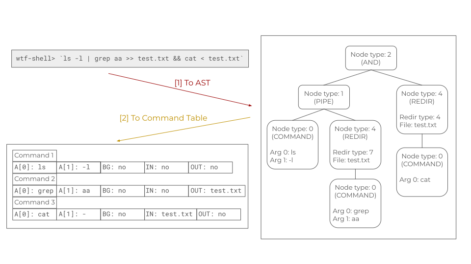

# Minishell

## Install Dependencies
### Macos
```bash
brew install readline
brew install check
brew install pkg-config
```

### Linux
```bash
sudo apt-get install libreadline-dev
sudo apt-get install check
sudo apt-get install pkg-config
```

## Notes

### 🌎 General
- Parsing:
- Exec:
	- Add builtins
		- echo - Done, minor probs with -n.
		- cd
		- pwd
		- export - Done, except maybe sorting out the prints.
		- unset - Done.
		- env - Done.
		- exit - Done, but no frees.
	- Exec non-builtins
		- Read system calls: dup/dup2
		- Read system calls: fork
		- Read system calls: waitpid
		- Read system calls: execve
- Free:
	- AST: done in reem's branch
	- Comm tab:
		- howard's version isnt yet done
		- reems's version is complete
			- free_redirection
			- free_command
			- free_command_table
	- env_list
- Now have `ft_realloc` in libft.
- Now have `ft_fprintf` in utils to circumvent fprintf.

### 🌴 Main
- stable

#### 🌿 Branch: tokens
- 26.11.2024 - stable & merged to main.

#### 🌿 Branch: h-parse
- 3.12.2024 - add `comm_table.c` under src/parser/
	- Maybe unnecessary, but works.
- Pull from main the stable ast parser.
- Then merge to main the command table parser.

#### 🌿 Branch: r-parser
- 1.12.2024 - parser done!
	- Delete `consume_token`& `get_token_type`?
	- If agreed, specify `tkn_type` & `node_type` in corresponding structs.
	- If agreed, change `parse()` to `parser()`.
- Merge the stable ast parser to main.

#### 🌿 Branch: h-echo
- 3.12.2024 - start with echo
	- How to deal with exit status?
	- How to remove trailing space? -> fixed
- Pull from main the stable ast and comm table parser
- Still have to polish exec.c
- 10.12.2024
	- echo seems ok, but not closing/pushing. Wait for confirmation.
- 11.12.2024 -- delete the remote, already contained in either h-export_unset or h_fork

#### 🌿 Branch: h-env_exit
- 10.12.2024
	- env & exit seem fine.
- 11.12.2024 -- delete the remote, already contained in either h-export_unset or h_fork

#### 🌿 Branch: h-export_unset
- 10.12.2024
	- unset postponed.
	- export can load a list and populated by the envvar
		- the list is initialized in main (has to be freed!)
- 11.12.2024
	- export seems working
		- should print alphabetically?
	- env: fixed problem where LS_COLORS cant print properly
		- has options to print which environmental variables
	- unset seems working
	- just remembered, exit probably has to free stuffs up.

#### 🌿 Branch: h-fork
- 11.12.2024 preliminary experiment with forks and executing non built-in functions.
- 12.12.2024 can execute ls, which. not sure what else.

## Collected materials:
- https://github.com/DimitriDaSilva/42_minishell
- https://github.com/appinha/42cursus-03-minishell
- https://github.com/twagger/minishell
- https://github.com/LeaYeh/minishell
- https://github.com/Swoorup/mysh
- https://www.cs.purdue.edu/homes/grr/SystemsProgrammingBook/Book/Chapter5-WritingYourOwnShell.pdf
- https://pubs.opengroup.org/onlinepubs/009695399/utilities/xcu_chap02.html
- https://m4nnb3ll.medium.com/minishell-building-a-mini-bash-a-42-project-b55a10598218
- https://brennan.io/2015/01/16/write-a-shell-in-c/
- https://www.linux.org/threads/bash-03-%E2%80%93-command-line-processing.38676/
- https://www.gnu.org/software/bash/manual/html_node/Definitions.html
- https://www.youtube.com/watch?v=ZjzMdsTWF0U
- https://www.youtube.com/watch?v=ubt-UjcQUYg
- https://www.youtube.com/watch?v=SToUyjAsaFk
- https://www.cs.uleth.ca/~holzmann/C/system/shell_does_pipeline.pdf
- https://github.com/coreutils/coreutils

## Scribbles
- dup vs dup2: duplicate a file descriptor. dup uses the lowest-numbered unused file descriptor, dup2 uses the file descriptor number specified in newfd.
On  success, these system calls return the new file descriptor.  On error, -1 is returned, and
       errno is set appropriately.
```
int dup(int oldfd);
int dup2(int oldfd, int newfd);
```

- fork: creates a new process by duplicating the calling process. On success, the PID of the child process is returned in the parent, and 0 is returned in the child. On failure, -1 is returned in the parent, no child process is created, and errno is set appropriately.
```
pid_t fork(void);
```
- wait vs waitpid:  wait for state changes in a child of the calling process, and obtain information about the child whose state has changed (child termination, stopped by signal, resumed by signal). wait() suspends execution of calling thread until one of its children terminates (returns the process ID of the terminated child on success; on error, -1). waitpid() suspends execution of calling thread until a child specified by pid has changed state (can be modified) (returns 0 on success or if WNOHANG was specified and no child(ren) specified by id has yet changed state; on error, -1.).
```
#include <sys/types.h>
#include <sys/wait.h>
pid_t wait(int *wstatus);
pid_t waitpid(pid_t pid, int *wstatus, int options);
```

- termios
Ctrl+C: Should interrupt the current process but not exit the shell itself.
Ctrl+Z: Should suspend the current process.
Ctrl+D: Should exit the shell only if no input is provided.
By default, these signals terminate or suspend the terminal session, but with termios, their behavior can be overridden.

When implementing job control (e.g., handling background and foreground processes), one might need to:
	- Suspend processes (Ctrl+Z).
	- Resume stopped jobs.
	- Assign terminal control to a foreground process.
The termios library can help by allowing the manipulation of the terminal's foreground process group with tcgetpgrp() and tcsetpgrp(). This ensures that when a process is in the foreground, it can read from and write to the terminal.

### Slides
Contains redundant content




### Allowed Funcs
- ugly table removed.